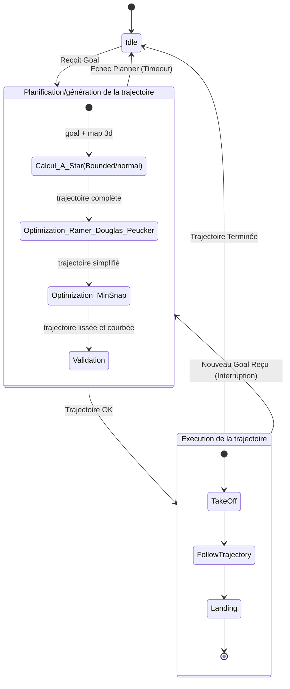
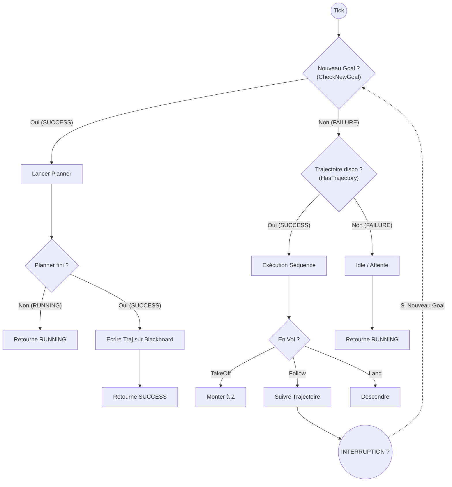

# PER2025–056 - Contrôle de vol d'un nano drone et détection de dérives comportementales (développement)

Logan Lucas (logan.lucas@etu.univ-cotedazur.fr) et Momen Takroun (tak.momen@gmail.com) - SI5 IoT-CPS; Noé Florence (noe@keflo.org) et Sacha Castillejos (sacha.cast03@gmail.com) - M2 IoT-CPS
Encadrant : Gérald Rocher (Gerald.ROCHER@univ-cotedazur.fr)

27 février 2026

## Présentation du sujet 

### Contexte
Le [Crazyflie 2.1+ de Bitcraze](https://www.bitcraze.io/products/crazyflie-2-1-plus/) est un nano-drone modulaire et open-source. Sa taille réduite en fait une plateforme idéale pour expérimenter à moindre coût. Il est équipé d'un [multi-ranger deck](https://www.bitcraze.io/products/multi-ranger-deck/) pour mesurer la distance aux objets tout autour du drone grâce à 4 capteurs laser, il est aussi équipé du [flow deck](https://www.bitcraze.io/products/flow-deck-v2/) permettant pour mesurer les mouvements et la distance par rapport au sol.

L’objectif de ce projet est de cartographier l’environnement en 3D avec des capteurs limités, de générer et de suivre une trajectoire en 3D et d’identifier les dérives comportementales par rapport aux trajectoires générées. D'abord en simulation puis des tests sur le vrai drone.

### Problèmes
La navigation autonome en 3D pour des nano-drones se heurte à plusieurs défis majeurs :

- Les capteurs embarqués ne sont pas adaptés pour la cartographie 3D classique (le multi-ranger possède seulement 4 lasers, là où un LiDAR 3D classique balaye les obstacles sur 360 degrés).

- Il n'existe pas de standard de navigation 3D "prêt à l'emploi", contrairement à la stack Nav2 qui permet de naviguer aisément en 2D.

- En raison de sa petite taille, le nano-drone est extrêmement sensible aux perturbations de l'environnement, ce qui entraîne des dérives comportementales importantes lors du vol.

### Utilisateurs
Ce projet s'adresse principalement aux chercheurs, étudiants ou développeurs cherchant à expérimenter des algorithmes de navigation, de cartographie 3D et d'analyse de dérives comportementales sur des drones aux ressources matérielles limitées et à bas coût.

### Hypothèses de travail
- **Environnement statique** : L'environnement est supposé fixe. La trajectoire est calculée en fonction de la carte scannée. Si un obstacle n'était pas présent ou a été mal scanné, il ne sera pas pris en compte lors du calcul de la trajectoire.
- **Marge de sécurité** : Les cibles définies par l'utilisateur ne doivent pas être positionnées à une distance inférieure à un seuil minimum d'un obstacle ou du sol (valeur paramétrable dans le fichier de configuration du package navigation3d) pour que la trajectoire soit considérée comme valide et puisse être calculée.

## Présentations des solutions
### Espace de solutions possibles
Pour la navigation 3D avec capteurs limités, plusieurs approches existent : l'utilisation d'algorithmes d'échantillonnage continus (comme RRT), l'utilisation de grilles discrètes (voxels), ou la cartographie externe (caméras de motion capture). La gestion de la carte peut se faire via de simples nuages de points (lourds à traiter) ou des structures optimisées.
### Solutions retenues 
- **Cartographie manuelle** : L'utilisateur peut explorer l'environnement via les touches du clavier, et une touche unique ajoutée permet de suivre une trajectoire en tire-bouchon vers le haut afin d'imiter ce que pourrait faire un lidar 3D. L'utilisateur peut via une autre touche enregistrer l'environnement sous la forme d'une OctoMap (on cartographie en nuage de points puis on convertit ce nuage de points en OctoMap).
  
  https://github.com/user-attachments/assets/856f0f26-4b23-4b09-af26-58c4cc180a4e
  
- **Définition d'une cible à atteindre** : L'utilisateur peut définir la position à atteindre avec un marker sur rviz.
- **Génération d'une trajectoire** : Calcul d'un chemin optimal entre le drone et la position cible en utilisant une "pipeline" hybride en trois étapes :
    1. A* (Recherche discrète) : Trouve le chemin le plus court en se déplaçant de bloc en bloc (voxels) au sein de la carte 3D générée (l'espace discret).
    2. Ramer-Douglas-Peucker (RDP) (Simplification) : Optimise le chemin brut généré par A* en supprimant les points de passage redondants ou inutiles.(notamment les escaliers dans les diagonales)
    3. Minimum Snap (Lissage) : Transforme les segments anguleux restants en courbes fluides. Cela évite les arrêts brutaux et les mouvements saccadés.
- **Décollage et atterrissage** automatique au départ et à l'arrivée d'une trajectoire
- **Changement de cible dynamique** : L'utilisateur peut modifier la cible à la volée en cours de vol.
- **Calcul de dérive** : Évaluation de la dérive du drone en comparant la trajectoire réellement effectuée avec la trajectoire générée initialement. Trois métriques complémentaires sont utilisées :
    - Average Displacement Error, estimation globale dans l’espace et dans le temps
    - Cross Track Error, écart instantané orthogonal à la trajectoire
    - Temporal Deviation Error, met en évidence les variations de vitesse ou les retards

## Positionnement des solutions par rapport à l'existant

### Choix de la méthode de cartographie 
Pour la cartographie, là où notre état de l'art parlait souvent des LiDAR 3D ou des caméras RGB-D, notre drone ne possède que 4 lasers unidirectionnels (multi-ranger deck). Pour compenser, nous simulons le balayage spatial d'un LiDAR par un vol ascendant en tire-bouchon afin de capturer l'environnement le plus justement possible en 3D.
Le choix de l'octomap pour représenter l'environnement a été décidé par l'algorithme de navigation choisi.

### Choix de la méthode de navigation 3D
Pour le développement  de la méthode de navigation, plusieurs grandes familles d'algorithmes s'offraient à nous :  les algorithmes basés sur l'échantillonnage (ex:RRT), les algorithmes de recherche discrète sur  graphe (ex:A*,Dijkstra), les algorithmes réactifs, les méthodes heuristiques ou encore l'apprentissage(Machine Learning/RL).

Sachant que l'application tourne sur nos ordinateurs, nous voulions privilégier une méthode garantissant que le chemin généré soit sans collision tout en effectuant la trajectoire la plus courte possible jusqu'à la cible. 
Pour ces raisons, nous avons écarté les approches heuristiques et réactifs, souvent sujettes aux minima locaux.
De plus, notre nano-drone n'étant équipé que de capteurs très limités (infrarouges et flux optique), il a fallu également éliminer les approches par apprentissage car elles nécessitent beaucoup de données capteur pour la phase d'apprentissage(souvent des données caméra qui plus est).
Enfin, notre choix s'est porté sur un algorithme de recherche discrète plutôt que sur l'échantillonnage. La recherche discrète offre des résultats plus précis, répétables (déterministes) et nous assure mathématiquement de trouver le chemin le plus court tout en évitant les obstacles connus de la carte. 

Ensuite, il a fallu chosir parmi les algorithmes de recherche lequel implémenter et nous avons opté pour A*. 
- Face à Dijkstra ce dernier explore l'espace de manière isotrope ce qui n'est pas pertinent et juste plus gourmand en ressource CPU.  
- D*/ D lite sont conçus pour des environnements dynamiques, en permettant une replanification rapide lorsqu'un nouvel obstacle apparaît, sans avoir à recalculer toute la trajectoire depuis le début. Cependant, notre cahier des charges repose sur l'hypothèse d'un environnement statique. Utiliser D* aurait ajouté une complexité d'implémentation
- JPS lui est conçu pour fonctionner avec une grille 2D alors que nous, on a besoin d'etre en 3D.

Explication de la pipeline de génération de trajectoires : A* -> RDP(Ramer-Douglas-Peucker) -> Minimum-snap
- A* : nous avons choisi A* car il garantit de trouver le chemin le plus court dans un espace discrétisé (comme la grille de voxels générée par notre OctoMap). Pour minimiser le temps de calcul , nous recherchons la trajectoire dans un espace bornée entre la cible à atteindre et le drone et si aucun chemin n'est trouvé dans cet espace, nous effectuions  une recherche avec des bornes plus élargies dans la grille (configurable dans le [fichier config du package de navigation](https://github.com/NoeFBou/projet_ros2_crazyflie/blob/main/navigation3d/config/planner.yaml))

    <details>
    <summary><b>Détail du fonctionnement de notre A*</b></summary>
    <br>

    L'algorithme A* cherche le chemin le plus court dans la grille de voxels 3D générée par notre OctoMap. 
        - **Heuristique :** Nous utilisons la distance Euclidienne en 3D pour évaluer le coût restant vers la cible. La fonction d'évaluation est classique : $f(n) = g(n) + h(n)$, où $g(n)$ est le coût de déplacement d'un voxel à l'autre, et $h(n)$ est la distance Euclidienne jusqu'à l'objectif.
        - **Optimisation par Bounding Box :** Pour éviter que A* ne sature le CPU en explorant toute la carte, nous limitons d'abord la recherche à une "bounding box" englobant le départ et l'arrivée (avec une marge configurable). Si aucun chemin n'est trouvé, cette zone de recherche s'étend dynamiquement (marge x4, puis limite maximale de 50m).
    </details>

- L'algorithme de Ramer-Douglas-Peucker : A* génère des chemins dits "en escalier" très dur à suivre pour le drone. Pour pallier ce problème, nous appliquons RDP. Cet algorithme filtre et supprime les points redondants ou quasi-alignés.

    <details>
    <summary><b>Détail du fonctionnement de RDP </b></summary>
    <br>

    Le chemin brut généré par A* forme des "escaliers" inutiles. RDP vient élaguer ces points en conservant la topologie globale du chemin. 
        - **Fonctionnement :** L'algorithme trace un segment entre le point de départ et le point d'arrivée. Il calcule ensuite la distance orthogonale de tous les points intermédiaires par rapport à ce segment. 
        - **Seuil de tolérance ($\epsilon$) :** Dans notre implémentation, tout point situé à une distance inférieure à $\epsilon = 0.08$ mètre de la ligne droite est considéré comme redondant et est supprimé. Si la distance dépasse $\epsilon$, le point est conservé et l'algorithme s'applique récursivement sur les nouveaux sous-segments.
    </details>

- L'optimisation "Minimum Snap" permet de relier nos points de notre trajectoire simplifiés en générant une courbe polynomiale lisse. En minimisant le "Snap", on minimise les arrêts brutaux du drône et on rend la trajectoire plus fluide

    <details>
    <summary><b>Fonctionnement de la librairie pour minimum snap</b></summary>
    <br>

    Un nano-drone ne peut pas tourner à angle droit sans risquer de décrocher. Le "Minimum Snap" génère une courbe polynomiale lisse en passant par les points restants (les *waypoints*).
        - **Le concept de Snap :** En dynamique des quadricoptères, les commandes des moteurs (poussée et angles d'attitude) sont directement liées aux dérivées supérieures de la position. Minimiser le *Snap* (la dérivée 4ème de la position, après la vitesse, l'accélération et le jerk) permet de minimiser les brusques variations de poussée différentielle.
        - **Modèle mathématique :** L'algorithme génère des polynômes de degré 7 entre chaque point pour minimiser la fonction de coût :
    $$J = \int_{T} ||\frac{d^4 \mathbf{r}}{dt^4}||^2 dt$$
        - **Sécurité et Réparation :** Puisque le lissage "arrondit" les angles, il arrive que la courbe lisse coupe un obstacle. Notre planificateur intègre une fonction `_check_and_repair` : il vérifie la trajectoire finale point par point. S'il détecte une collision, il force l'ajout d'un nouveau point de passage (le voxel sûr le plus proche) et relance l'optimisation mathématique.
    </details>

Explication du superviseur : pour suivre les trajectoires générées, nous utilisons un behavior tree.
Il s'occupe de générer la trajectoire à partir des données de l'octomap et des positions du drone et de la cible à atteindre. Il gère ensuite le suivi de la trajectoire générée  par le drone. Il decolle et atterrit en début et fin de trajectoire quand c'est nécessaire et l'utilisateur a la capacité  de changer la cible à atteindre pendant qu'une trajectoire en cours de suivi.
Pour aller plus loin, vous pouvez consulter les schémas suivants pour mieux comprendre les étapes de notre superviseur : 
[Voir le diagramme](#diagramme-visuel-de-larbre-de-comportement-du-superviseur-de-la-navigation-3d)
[Voir le flux de décision](#flux-de-décision-du-superviseur-de-la-navigation-3d)

## Travail réalisé : Produit et Processus
### Le Produit (Fonctionnalités livrées)

- Noeud de cartographie manuelle avec fonction "tire-bouchon" et conversion en OctoMap 3D. (Simulation + Réalité)

- Marker (via RViz) permettant à l'utilisateur de définir une cible 3D à atteindre, modifiable à la volée en cours de vol. (Simulation)

- Noeuds de Génération de trajectoire  (Pipeline A* -> RDP -> Minimum Snap). (Simulation)

- Superviseur pour suivre une trajectoire générée


- Noeud de localisation dans l'environnement 

- Noeud d'évaluation des dérives utilisant trois métriques : Average Displacement Error (estimation spatio-temporelle globale), Cross Track Error (écart instantané orthogonal), et Temporal Deviation Error (variations de vitesse/retards). (Simulation)

### Le processus de réalisation du projet
Le développement de ce projet a suivi les étapes suivantes : 
1. Réalisation d'un état de l'art sur : la localisation dans l'espace, sur les représentation de l'environnement en 3d et sur les algorithmes de navigation pour drone quadrimoteurs.[liens de l'état de l'art réalisé](https://github.com/NoeFBou/projet_ros2_crazyflie/blob/main/ressource/Etat%20de%20l'art.pdf)
2. Développement d'un moyen de cartographier l'environnement avec les capteurs présents sur le drone en simulation
3. Développement d'un générateur de trajectoire avec l'algorithme A*
4. Integration de la méthode du minimium snap pour améliorer la courbe générée précédement 
5. Developpement d'un noeud de calcul de dérive de la trajectoire 
6. Ajout de l'algorithme de Ramer-Douglas-Peucker pour lisser la courbe générée par A*
7. Développment du superviseur pour suivre la trajectoire générée
8. Test de la cartographie dans le monde réel


## Perspectives d'évolution
Ce projet ouvre la voie à des développements plus poussés :
- Algorithmique et Évitement Dynamique
    - **Algorithmes continus :** Explorer des approches basées sur l'échantillonnage optimal (comme RRT*) ou des méthodes bio-inspirées pour la planification dans des environnements non cartographiés.
    - **Replanification locale :** Intégrer un planificateur local (ex: DWA 3D ou TEB) pour gérer l'évitement d'obstacles dynamiques, en complément de notre planificateur global (A*).
    - **Contrôle Prédictif :** Améliorer le contrôleur de vol(le noeud qui suit la trajectoire) pour compenser les dérives comportementales en temps réel, notamment face aux perturbations (vent).
    - **Correction dynamique de la trajectoire généré :** utiliser les métriques de dérive calculées pour ajuster la trajectoire générée à la volée.
- **Passage de la simulation à la réalité** pour la stack de navigation et de dérives comportementales
- Cartographie Avancée :
    - **SLAM 3D Autonome :** Passer d'une cartographie manuelle à une approche SLAM (Simultaneous Localization and Mapping), permettant au drone de découvrir et naviguer simultanément.
    - **Fusion de capteurs externe :** Coupler le système avec un système de capture de mouvement (OptiTrack/Vicon) pour l'évaluation des dérives, ou utiliser la caméra pour la cartographie.
- Robotique Multi-Agents (Swarm):
    - **Cartographie collaborative :** Déployer un essaim de nano-drones pour fusionner plusieurs nuages de points locaux en une seule OctoMap globale
    - **Navigation en formation :** Implémenter des algorithmes de *flocking* pour permettre à plusieurs drones de naviguer de concert dans le même espace 3D sans collision inter-agents, ou de se suivre dynamiquement.(inspirée des comportements qu'on retrouve dans la nature)


## Liste de références bibliographiques
- Bitcraze Crazyflie 2.1+ : https://www.bitcraze.io/products/crazyflie-2-1-plus/

- Multi-ranger deck : https://www.bitcraze.io/products/multi-ranger-deck/

- Flow deck v2 : https://www.bitcraze.io/products/flow-deck-v2/

- Librairie utilisé pour le minimun-snap : https://github.com/Hs293Go/minsnap_trajectories


# Structure du Répertoire
```
├── crazyflie_manual_3dcarto package #package de la cartographie
│   ├── config # paramètre de rviz et des noeuds 
│   ├── crazyflie_manual_3dcarto
│   │   ├── save_points_cloud.py #noeud de sauvegarde du nuage de point 
│   │   ├── scan_to_pcd.py #noeud de conversion du nuage de point
│   │   └── teleop_save.py #noeud de commande manuel du drone  
│   └──  launch # Fichiers de lancement du mode réel et de simulation
├── navigation3d
│   ├── config # paramètre des noeuds 
│   │   └── planner.yaml
│   ├── launch # Fichiers de lancement
│   ├── maps # octomap utilisé dans la simulation
│   ├── meshes 
│   ├── navigation3d
│   │   ├── interactive_marker_pose_stamped.py # noeud du marker cible 
│   │   ├── lib
│   │   │   ├── astar.py #algo a*
│   │   │   ├── minimum_snap.py #methode minimun snap
│   │   │   └── octomap_reader.py #lecteur de l octomap
│   │   ├── planner.py #noeud pour planifier les trajectoires
│   │   ├── supervisor.py #noeud superviseur
│   │   └── trajectories_follower.py #noeud pour suivre une trajectoire
│   ├── rviz #config de rviz pour la navigation
│   └── worlds # map utilisé dans la simulation
└── navigation3d_interfaces #utilitaire pour le noeud de suivi de la trajectoire
```

# Prérequis Système
- OS : Ubuntu 22.04 LTS (Jammy Jellyfish)
- Simulateur : Gazebo Sim
- ROS Version : ROS 2 Humble Hawksbill
- Python Version : Python 3.10 ou supérieure

# Installation

```bash
sudo apt update
cd ~/crazyflie_ws/src/
git clone https://github.com/NoeFBou/projet_ros2_crazyflie.git
sudo apt install -y ros-humble-desktop ros-humble-octomap ros-humble-octomap-server ros-humble-octomap-rviz-plugins ros-humble-tf-transformations ros-humble-py-trees ros-humble-py-trees-ros ros-humble-interactive-markers
sudo apt install python3-pip
pip3 install numpy scipy transforms3d
sudo apt install ros-humble-py-trees -y
sudo apt install ros-humble-py-trees-ros -y
sudo apt install -y python3-rosdep
sudo rosdep init
rosdep update
rosdep install --from-paths src --ignore-src -r -y
colcon build --symlink-install
```

**Dépannage** : Si une autre version de Gazebo est déjà installée sur votre système, nous vous conseillons de la désinstaller pour éviter tout conflit.

## Lancement

### Partie cartographie

- Lancement de la cartographie 3D en **simulation** : 
```bash
source /opt/ros/humble/setup.bash
source install/setup.bash
ros2 launch crazyflie_manual_3dcarto simple_mapper_simulation.py
ros2 launch crazyflie_manual_3dcarto launch.3dcarto_setup.py sim:=True # dans un autre terminal
ros2 run crazyflie_manual_3dcarto teleop_save # dans un autre terminal 
```
- Lancement de la cartographie 3D en **réel** : 
```bash
source /opt/ros/humble/setup.bash
source install/setup.bash
ros2 launch crazyflie_manual_3dcarto simple_mapper_real.py
ros2 launch crazyflie_manual_3dcarto launch.3dcarto_setup.py sim:=False # dans un autre terminal
ros2 run crazyflie_manual_3dcarto teleop_save # dans un autre terminal 
```

### Partie Navigation 3D et dérive

- Lancement de la navigation 3D en **simulation** :
```bash
cd ~/crazyflie_ws/
source /opt/ros/humble/setup.bash
source install/setup.bash
ros2 launch navigation3d launchtest.launch.py
```

Commandes pour zoomer et suivre le drone dans Gazebo :
```bash
ign service -s /gui/follow --reqtype ignition.msgs.StringMsg --reptype ignition.msgs.Boolean --timeout 2000 --req 'data: "crazyflie"'
ign service -s /gui/follow/offset --reqtype ignition.msgs.Vector3d --reptype ignition.msgs.Boolean --timeout 2000 --req 'x: -0.2, y: 0.0, z: 0.1'
```

Pour changer de monde simulé et/ou d'octomap chargé, vous pouvez modifier le chemin dans le fichier launch de la partie navigation

## Flux de Décision du superviseur de la navigation 3D

## Diagramme Visuel de l'arbre de comportement du superviseur de la navigation 3D


